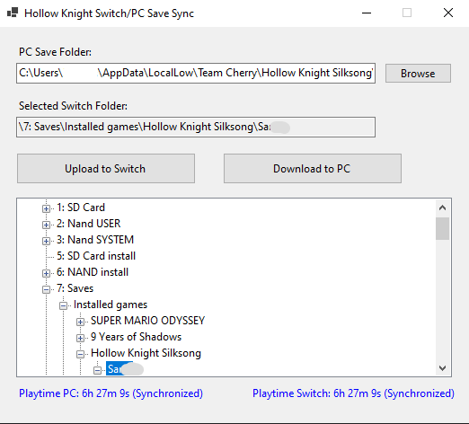

# Hollow Knight Silksong Save Sync (Switch/PC)

A Windows desktop tool to synchronize save files of **Hollow Knight Silksong**  between a **Switch** (via USB MTP using [DBI](https://github.com/rashevskyv/dbi)) and a **PC**.

## ✨ Features
- 📂 **Browse PC save folder** easily.
- 🎮 **Explore Switch save folder** with a built-in MTP explorer (requires DBI on the Switch).
- 🔄 **Two-way sync**:
  - send saves from PC → Switch
  - send saves from Switch → PC
- 🔐 **Encryption/Decryption** of `.dat` files (PC saves are encrypted, Switch saves are plain).
- 🕒 **Playtime comparison**:
  - Shows playtime for PC and Switch saves.
  - Highlights which save is newer.
  - Marks both as **Synchronized** if playtime is equal.
- ⚠️ **Overwrite warnings**:
  - Alerts you if you are about to overwrite a newer save with an older one.
  - **Important:** at the moment the tool replaces **all save files found for Hollow Knight Silksong **, not individual files.
  - Saves must have the same version of the game to be compatible.

## 🛠️ Requirements
- Windows 10/11
- [.NET 6 SDK](https://dotnet.microsoft.com/en-us/download/dotnet/6.0)
- Hollow Knight silksong save files on both PC and Switch
- Switch connected via **MTP**
  - Requires [DBI](https://github.com/rashevskyv/dbi) (homebrew app) to expose game saves over MTP

Main window:

📖 Usage
**Important:** Switch must be connected in MTP Mode before running the program.

1. Select the PC save folder
  Saves are stored in the following path on Windows:
    - "C:\Users\[USER]\AppData\LocalLow\Team Cherry\Hollow Knight Silksong\[randomnumber]"

    - [USER] → your Windows username
    - [randomnumber] → a random identifier generated by the game
2. Select the Switch save folder
    With DBI running on your Switch, you can find the Hollow Knight Silksong saves here:
    - "\7: Saves\Installed games\Hollow Knight Silksong\[USERSWITCH]"
    - [USERSWITCH] → your Switch user profile folder

3. Choose the operation:
    - Upload to Switch → copies PC saves to the Switch
    - Download to PC → copies Switch saves to the PC

    The app will:
    - Automatically backup both sides before syncing in a folder
    - Show playtime comparison (PC vs Switch)
    - Warn you if one side has an older save

⚠️ Disclaimer
- This tool is a fan-made utility.
- Requires DBI (or a similar homebrew) for Switch MTP access.
- Use at your own risk. Always keep backups of your saves.
- Current limitation: the application replaces all Hollow Knight save files it finds on the selected side (PC or Switch). Fine-grained file selection is not yet supported.